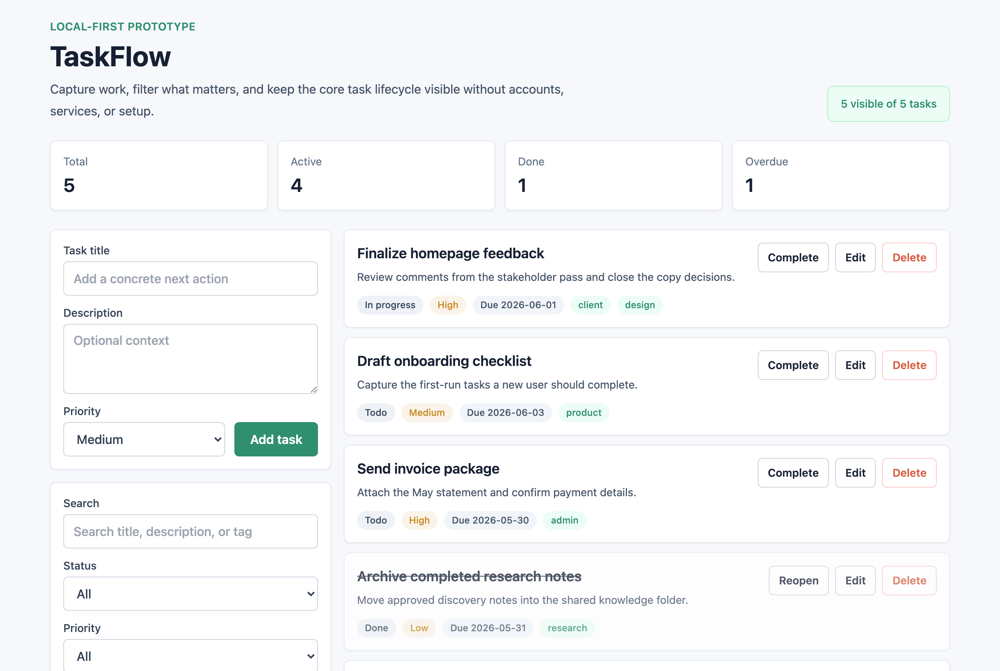
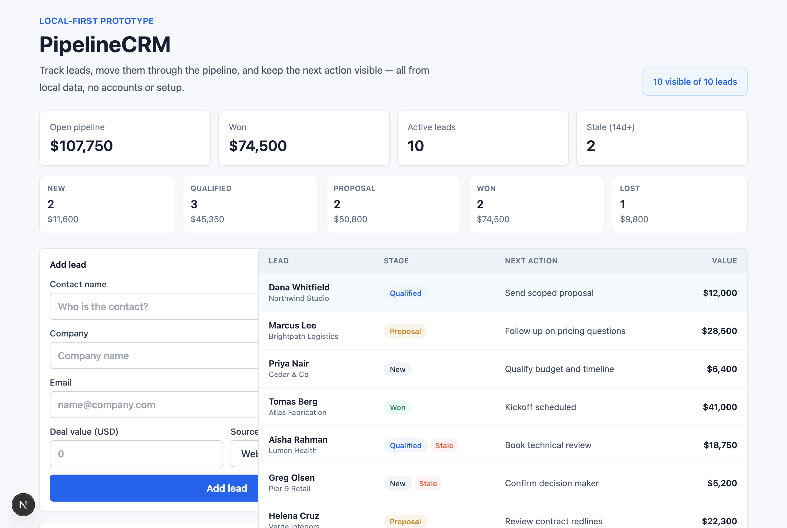
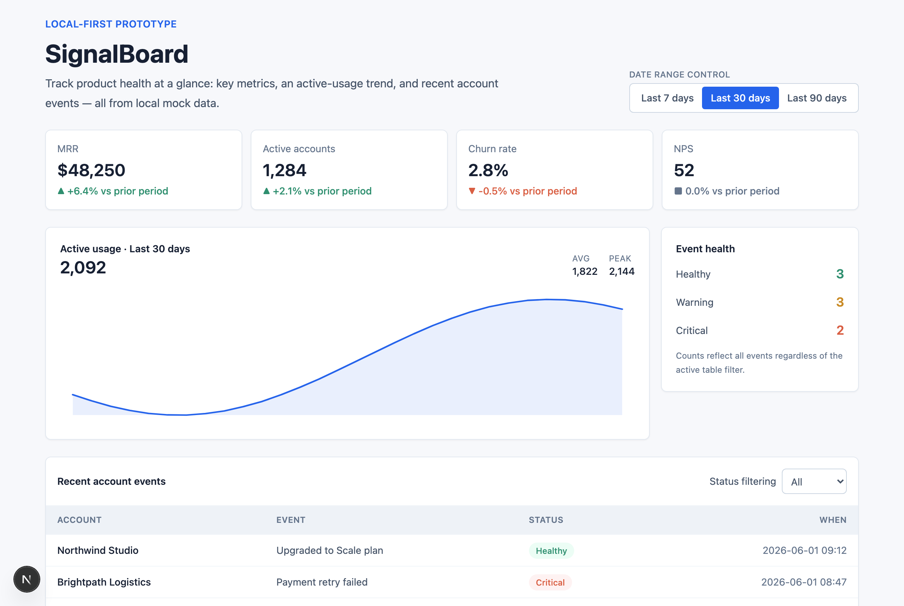
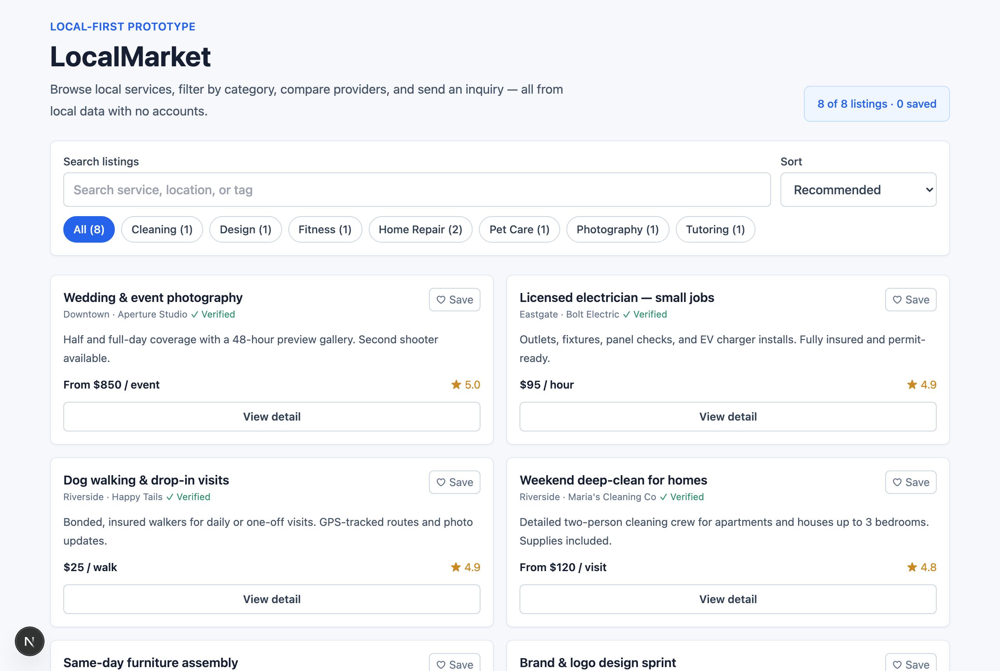
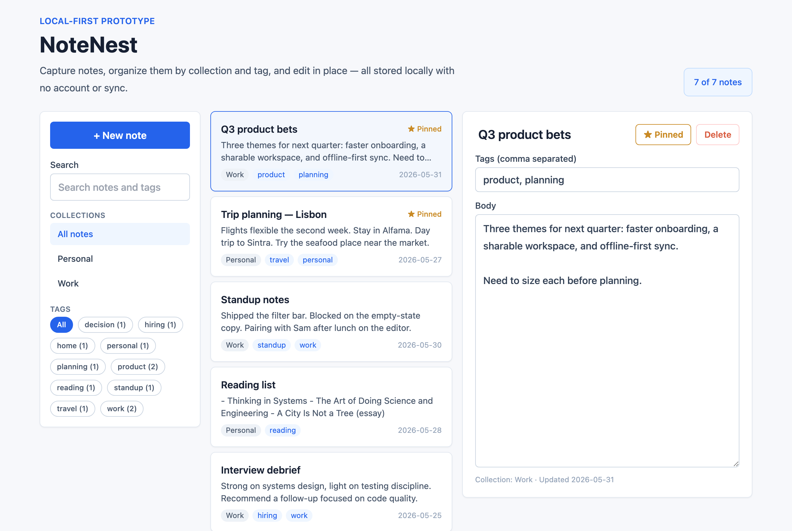
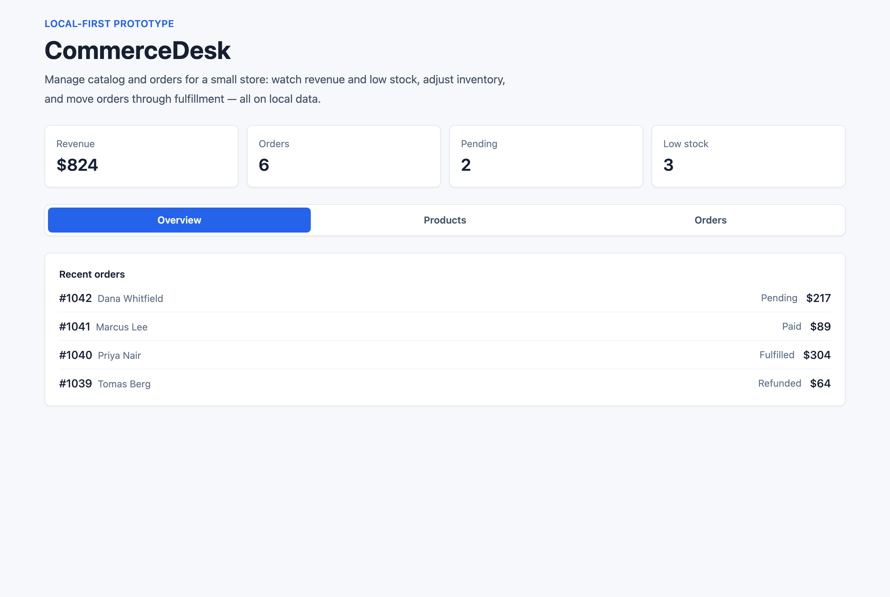
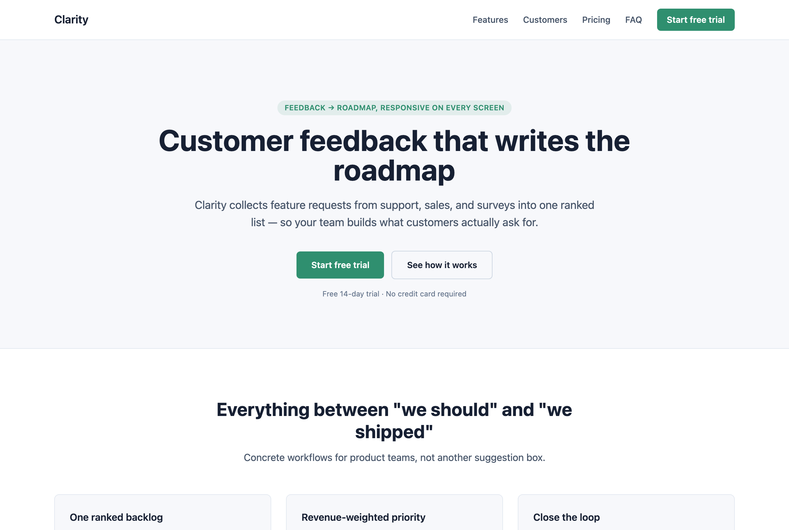
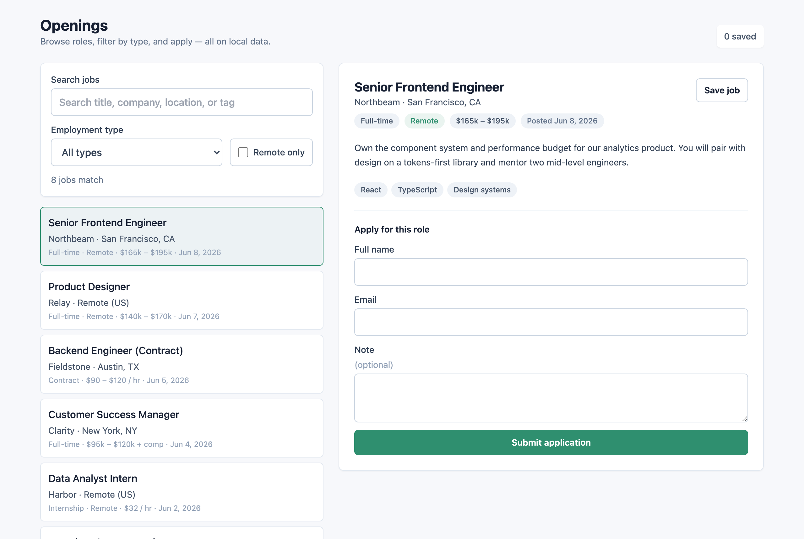
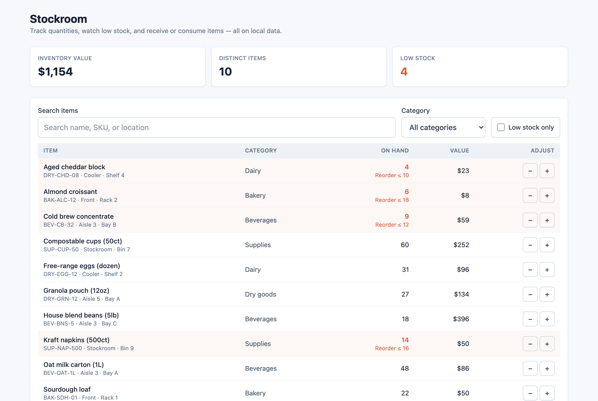
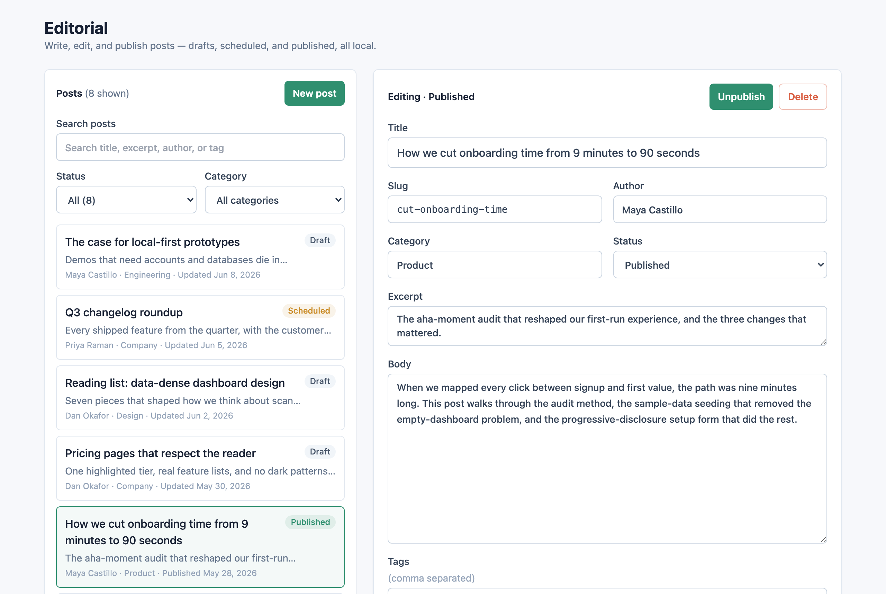

<div align="center">


### ⭐ Stars are appreciated!

**Local-first AI app-builder brain for Claude Code, Codex, and Cursor.**

Buildable gives your coding agent the product intelligence that hosted no-code builders (Lovable, Replit Agent, Base44, Emergent) hide behind their infrastructure — archetypes, golden templates, UI/UX playbooks, and a review loop — so it goes from a vague prompt to a polished prototype, using only a small slice of context per request.

It does **not** replace your agent or run as a hosted platform. It is a file-based skills/plugin package that runs locally. Buildable is independent and is not affiliated with, endorsed by, or sponsored by those products.


<br />

[](https://github.com/suntay44/buildable-plugin-skills/actions/workflows/ci.yml)
[](LICENSE)
[](https://claude.ai/code)
[](https://chatgpt.com/codex)
[](https://cursor.sh)
[](https://expo.dev)

<br />
</div>


## Contents

- [Why Buildable](#why-buildable)
- [What it is](#what-it-is-and-when-to-use-it)
- [Example workflows](#example-workflows)
- [Quick start](#quick-start)
- [Install as a plugin](#install-as-a-plugin)
- [CLI commands](#cli-commands)
- [Slash commands and MCP](#slash-commands-and-mcp)
- [Templates](#templates)
- [How much it guides](#how-much-it-guides)
- [Token efficiency](#token-efficiency)
- [Supported app types](#supported-app-types)
- [Non-goals](#non-goals)
- [Stability](#stability)
- [Roadmap](ROADMAP.md)
- [Repository map](#repository-map)
- [Templates catalog](#templates-catalog)
- [License](#license)

---

## Why Buildable

A raw coding agent starts every app from a blank slate. Hosted builders feel magical because they already know what a "todo app" or "CRM" should contain. Buildable packages that same knowledge locally:

- **Runnable starters first** — 15 build-verified golden starters for the most common app types, plus 55 archetypes it recognizes and plans, so even the long tail gets a real spec and implementation plan instead of a blank slate.
- **Micro-blocks** — small reusable UI/product units (filterable table, detail panel, stat-card grid, form, empty state) that `plan` selects per app and the agent composes, instead of reinventing each one.
- **Adapt, don't invent** — the agent starts from a proven golden template and adapts it to the prompt, instead of reconstructing app structure from scratch.
- **UI/UX system guidance** — compact design profiles plus patterns for forms, tables, filters, empty states, and responsive layout.
- **Plan + review loop** — a CLI that classifies prompts, emits an app spec, and audits the result.
- **Progressive loading** — the agent reads only the references a prompt needs, not the whole repo.

## What it is (and when to use it)

Buildable is a **product-structure compiler, compact UI/UX brain, and quality gate** for your coding agent: it decides *what* to build (archetype → screens, entities, features, states), selects reusable `blocks`, gives the app a selected `designSystem`, copies a **runnable, build-verified starter**, and **reviews** the result (build, layout, accessibility, state coverage, local-first). It is not a hosted builder.

| | Buildable | Design plugins (e.g. Frontend Design) | Hosted builders (Lovable, v0, Replit) |
| --- | :---: | :---: | :---: |
| Decides product structure | ✅ | — | ✅ |
| Runnable, build-verified code | ✅ | — | hosted |
| Reviews / grades the output | ✅ | — | — |
| Local — your repo, your agent | ✅ | ✅ | — |
| Gives UI/UX direction | ✅ | ✅ | ✅ |
| Deep brand/art direction | guided | ✅ | ✅ |

**Pairs with dedicated design skills:** Buildable decides what to build, gives compact product-specific UI/UX direction, and proves it works; add a design skill when you want high-end brand exploration, custom art direction, or multiple visual concepts.

- **Use it when** you want consistent, real prototypes for common app types — fast, in your own stack, no lock-in.
- **Skip it when** you need a one-off component or throwaway script; a raw agent is enough.

**Proof it's real, not a prompt wrapper:** every one of the 15 starters is built and type-checked in CI, the CLI is covered by 77 tests with zero runtime dependencies, and each plan loads only ~10% of the bundled brain. See it yourself — `buildable eval --compare` prints the numbers, and the [generated screenshots](#what-it-generates) are unedited single-prompt output.

## Example workflows

Buildable is **audit-first**: before code is written, `plan` creates a reusable build contract with the chosen app type, target, template, selected micro-blocks, screens, entities, features, references, guardrails, design profile, mock-data needs, and review gates. If the prompt is vague, it stops and asks the product-direction question first. If the prompt is clear, it adds optional prompt-refinement questions with sensible defaults so the agent can keep momentum without oversteering.

### Fresh app

```bash
buildable plan "Build me a CRM for tracking leads"
buildable design "Build me a CRM for tracking leads"
buildable generate "Build me a CRM for tracking leads"
cd leadflow
buildable review
```

What happens:

- `plan` writes `.buildable/phase-plan.md`, `.buildable/phase-plan.json`, and `.buildable/phase-plan.toon`. These are decision/context files, not app source.
- `plan` also selects compatible `appSpec.blocks`; block docs are appended to `appSpec.references`, so agents load only the reusable building blocks this app actually needs.
- `design` turns the selected design system into concrete UI/UX tokens, page rules, component states, and realistic mockup-data guidance.
- `generate` creates the app folder. If the selected template is runnable, it copies build-verified starter source. If the selected template is planned-only, `--plan-pack` writes an implementation pack instead of source.
- `review` audits the generated app against the saved spec, local-first rules, UI completeness, accessibility signals, responsive layout, and optional build output.

Behind the scenes this distinction is explicit: `plan` outputs a `buildable-phase-plan` with `workflowStage: decision`; `generate` writes a `buildable-generated-project` config with `workflowStage: generated-files` and `sourcePlan` set to either `saved-phase-plan` or `inline-prompt-plan`.

### Existing app

```bash
cd my-existing-app
buildable init --existing
buildable plan "Add a local-first customer notes workflow"
buildable design --page customer-notes --write
buildable generate "Add a local-first customer notes workflow" --augment
buildable review
```

What happens:

- `init --existing` makes the current repo Buildable-aware without overwriting code.
- `plan` records the intended feature direction and selected references in `.buildable/`.
- `design --page` can be used mid-session for one screen or component.
- `generate --augment` writes Buildable implementation guidance for the existing app instead of copying a new starter over it.

### With screenshots or files

```bash
buildable plan "Use this screenshot for a CRM dashboard" --file ./crm-mockup.png
buildable design --write
buildable generate "Use this screenshot for a CRM dashboard"
```

Buildable stores explicit user files in `appSpec.referenceInputs`, so the agent inspects only those files plus the selected `appSpec.references`. It does not scan every template or every knowledge file.

The recommended flow is **Plan > Design > Generate > Review**, but the commands are interchangeable: use `design` before planning for visual exploration, after planning to sharpen the UI, or mid-build for a specific page. After `plan` or `design`, the agent should ask whether the user is satisfied. If not, revise the saved phase plan; if yes, continue to `generate` or implementation.

## Quick start

```bash
npm install
npm link
buildable check
buildable plan "Build me a task manager"
buildable design "Build me a task manager"
buildable generate "Build me a task manager"
cd taskflow
buildable status
buildable review
```

With a screenshot or file reference:

```bash
buildable plan "Use this screenshot for a CRM" --file ./crm-mockup.png
buildable design --write
buildable generate "Use this screenshot for a CRM"
```

Prefer not to link a global command? Run through Node:

```bash
node ./bin/buildable.mjs check
node ./bin/buildable.mjs plan "Build me a mobile habit tracker"
```

See [docs/install.md](docs/install.md) for Codex Desktop, Claude Code, Cursor, and CLI setup notes.

## Install as a plugin

### Claude Code

Buildable ships a plugin manifest (`.claude-plugin/plugin.json`) and a local marketplace (`.claude-plugin/marketplace.json`):

```txt
/plugin marketplace add suntay44/buildable-plugin-skills
/plugin install buildable@buildable
```

This auto-discovers the planner, web-builder, mobile-builder, and reviewer skills and registers these slash commands:

| Command | What it does |
| --- | --- |
| `/buildable-plan` | Create or revise the audit-first phase plan, app spec, selected references, and prompt-refinement questions |
| `/buildable-design` | Create a UI/UX-only brief from the prompt, saved plan, or current app spec |
| `/buildable-generate` | Create local project files from the saved plan: copy a runnable starter, write an augment pack, or write a planned-template pack |
| `/buildable-status` | Inspect the current workspace and suggest the next safe command |
| `/buildable-review` | Audit a prototype against the saved app spec (`--build` runs typecheck/build) |
| `/buildable-preview` | Optional: render the running app, screenshot it, catch runtime errors |
| `/buildable-init` | Make the current workspace Buildable-aware |

### Cursor

Use the slash commands in `.cursor/commands/` plus the rule at `.cursor/rules/buildable.mdc`.

### Codex

Load `.codex-plugin/plugin.json` when your Codex surface supports local plugins/skills. For desktop or tool clients that cannot run project slash commands directly, register the MCP bridge shown below.

## CLI commands

| Command | Purpose |
| --- | --- |
| `buildable plan "<prompt>" [--file <path>] [--with-auth] [--no-write]` | Create or revise the audit-first decision files: `.buildable/phase-plan.md/json/toon`. It classifies the prompt, preserves explicit screenshots/files, selects compatible micro-blocks, asks blocking product questions when needed, adds optional refinement questions with defaults, and selects only the references the agent should load. |
| `buildable design "<prompt>" [--page <surface>] [--dark] [--write]` | Produce a UI/UX-only brief with concrete tokens (every profile ships light **and** dark palettes; `--dark` activates the dark theme), mockup-data guidance, and page/component rules; can use the current app spec |
| `buildable generate "<prompt>" [--out <dir>]` | Create local project files from the saved plan. Runnable templates copy starter source; `--plan-pack` writes implementation files for planned templates; `--augment` writes guidance into an existing app. |
| `buildable status [path]` | Read-only workflow inspector: reports whether the workspace is uninitialized, planned, blocked, design-ready, generated, or reviewed, then suggests the next command |
| `buildable review [path] [--build]` | Audit the current app by default; optional path reviews another folder, optional `--build` runs typecheck/build |
| `buildable preview [path] --url <url>` | Optional: render the running app in a headless browser; screenshot + catch runtime errors |
| `buildable init [--existing]` | Create `.buildable` config for a workspace |
| `buildable mcp` | Start the optional Buildable MCP stdio bridge for desktop/agent clients |
| `buildable check` | Verify local assets, adapters, and template references |
| `buildable list` | List archetypes and runnable/planned template status |
| `buildable eval [--compare]` | Score classification, efficiency, and spec quality (`--compare` vs a raw prompt) |

`plan` emits an `enhancedPrompt` and `appSpec` with the selected archetype, target, stack, template, micro-blocks, design system, references, expected features, acceptance criteria, explicit user `referenceInputs`, audit-first `planAudit`, smart `promptRefinement` questions, and no-hosted-feature guardrails. Matching uses compact tags in `core/archetype-registry.json`, so the agent classifies against one small registry instead of reading every archetype file.

A few things worth knowing about the flow:

- **`plan` is the routing source.** It classifies the prompt, picks the archetype/template/blocks, lists the exact references to load, and asks blocking questions only when product direction or architecture-changing choices are unclear. Not satisfied? Revise the saved `.buildable/phase-plan.*` and keep planning before you generate.
- **`generate` reuses the saved plan.** If `.buildable/phase-plan.json` matches the prompt, it builds from that audited plan instead of re-planning, then writes the compact `.toon` contract into the generated app. Use `--augment` to plan into an existing app instead of copying a new starter.
- **`status` keeps sessions oriented.** It reads only local Buildable files and expected app files, then tells Codex/Claude/Cursor whether to plan, answer questions, design, generate, review, or keep fixing.
- **`review` is a real gate.** Add `--build` to run typecheck/build, and `--strict` to fail (not just warn) on local-first guardrail drift.

### Review

`buildable review` audits the app spec, source representation, local-first guardrails, responsive-layout risk, accessibility signals, state coverage, **design-token discipline** (components that hard-code colors instead of using theme tokens get flagged), and — when persistence was requested — whether storage sits behind the repository seam. Add `--build` only when you also want it to run installed typecheck/build scripts. It is a static/local quality gate, not a replacement for manual QA, browser screenshots, or real device/simulator checks when visuals matter.

Design quality is graded against surface-specific rubrics, not taste: every plan loads the base web/mobile rubric plus a specialized one (`content-marketing`, `data-dense`, or `forms-auth`) selected by the app's design profile, backed by the shared token scales in `core/design-system-registry.json` (`foundations`). This is the part a hosted builder can't give you: design quality as an enforceable, local gate.

`review` also prints an advisory **readiness** section — an honest "what's left to productionize" list derived from the spec. It names what's intentionally mocked (in-memory vs local-persisted data, mock vs named-provider auth, no deploy) and points at the seam that makes each real (the persistence ladder, the auth seam). It is advice, not a gate: Buildable never auto-adds a backend — it tells you the local-first path to a real one.

## Slash Commands and MCP

Buildable is command-first. Use the lightest integration your agent surface supports:

- **Terminal / CLI:** run `buildable plan`, `buildable design`, `buildable generate`, `buildable status`, `buildable review`, and the other commands above.
- **Project slash commands/rules:** Claude Code uses `/buildable-*`; Cursor uses `.cursor/commands/` and `.cursor/rules/buildable.mdc`; Codex can load the plugin manifest when local plugins are supported.
- **MCP bridge:** use `buildable mcp` only for desktop or agent tool clients that cannot run those project commands directly. The client sees local tools named `buildable_plan`, `buildable_design`, `buildable_generate`, `buildable_status`, `buildable_review`, `buildable_init`, `buildable_list`, `buildable_check`, `buildable_eval`, and `buildable_preview`.

MCP does not load the whole Buildable brain. Each tool calls the same CLI engine, which returns a compact plan/spec and the exact `appSpec.references` the agent should inspect. Keep `BUILDABLE_WORKSPACE` pointed at the app folder you want the desktop client to work in.

Example local MCP config:

```json
{
  "mcpServers": {
    "buildable": {
      "command": "node",
      "args": ["/absolute/path/to/buildable-plugin-skills/bin/buildable-mcp.mjs"],
      "env": {
        "BUILDABLE_WORKSPACE": "/absolute/path/to/your-app"
      }
    }
  }
}
```

Use that shape in Claude Desktop's local MCP settings, Cursor's `.cursor/mcp.json` / `~/.cursor/mcp.json`, or the equivalent Codex MCP config. For Codex config TOML, the same server is typically:

```toml
[mcp_servers.buildable]
command = "node"
args = ["/absolute/path/to/buildable-plugin-skills/bin/buildable-mcp.mjs"]
env = { BUILDABLE_WORKSPACE = "/absolute/path/to/your-app" }
```

This makes the same Buildable actions available in desktop apps, but the UI may show them as tools instead of slash commands. If a desktop app already supports project slash commands or a local plugin install, prefer that; use MCP as the compatibility bridge.

<details>
<summary><strong>Optional: visual preview</strong> (for headless/CI or agents without a screenshot tool)</summary>

Most of the time you can just open `localhost` yourself, and agents that already have a screenshot/preview tool (such as Claude Code's preview) should use that. `buildable preview` exists for the cases that have neither — a fully autonomous or CI run that still needs to know whether the page actually renders. Start the dev server, then:

```bash
buildable preview --url http://localhost:3000
```

It loads the page in a headless browser (Playwright — optional, resolved from the app or Buildable), writes `.buildable/preview.png`, and fails on a blank render or uncaught runtime errors — the visual issues `tsc`/`build` can't see. It is the only feature that needs a browser binary, so it stays optional and skips gracefully when Playwright is absent. It targets browser-rendered web apps today; native mobile visual checks would need a simulator and remain future work.

</details>

## Templates

Golden templates are Buildable's approved starting points. They come in two levels:

- **Runnable starters** copy real, build-verified source into the user's local folder.
- **Planned template packs** do not copy app source yet; they write a scoped `IMPLEMENTATION_PLAN.md`, `buildable-app-spec.json`, and reference list so Claude, Codex, Cursor, or another agent can implement the app without reading every template.

Only templates marked `✅ runnable` are copied by `buildable generate` without extra flags. Templates marked `📝 planned` need `buildable generate "<prompt>" --plan-pack`; that writes instructions and specs, not runnable source.

Runnable coverage grows release over release (**9 → 15 in v0.3**; see the [roadmap](ROADMAP.md)). Planned packs aren't stubs — they emit a full app spec, implementation plan, and scoped reference list, so the agent builds the long tail from a real contract instead of from scratch.

### What it generates

Real, unedited output — each rendered straight from a single prompt against its runnable starter:

<table>
  <tr>
    <td width="50%"><br><sub><code>buildable generate "Build me a todo app"</code></sub></td>
    <td width="50%"><br><sub><code>buildable generate "Build me a CRM for tracking leads"</code></sub></td>
  </tr>
  <tr>
    <td width="50%"><br><sub><code>buildable generate "Build me a SaaS analytics dashboard"</code></sub></td>
    <td width="50%"><br><sub><code>buildable generate "Build me a marketplace for local services"</code></sub></td>
  </tr>
  <tr>
    <td width="50%"><br><sub><code>buildable generate "Build me a notes app for organizing ideas"</code></sub></td>
    <td width="50%"><br><sub><code>buildable generate "Build me an ecommerce admin to manage products and orders"</code></sub></td>
  </tr>
  <tr>
    <td width="50%"><br><sub><code>buildable generate "Build me a landing page for my startup"</code></sub></td>
    <td width="50%"><br><sub><code>buildable generate "Build me a job board with apply forms"</code></sub></td>
  </tr>
  <tr>
    <td width="50%"><br><sub><code>buildable generate "Build me an inventory manager with low-stock alerts"</code></sub></td>
    <td width="50%"><br><sub><code>buildable generate "Build me a blog with a CMS editor"</code></sub></td>
  </tr>
</table>

| Template | Target | Status |
| --- | --- | --- |
| `templates/web/task-manager` | web | ✅ runnable |
| `templates/web/crm` | web | ✅ runnable |
| `templates/web/dashboard` | web | ✅ runnable |
| `templates/web/marketplace` | web | ✅ runnable |
| `templates/web/notes` | web | ✅ runnable |
| `templates/web/ecommerce-admin` | web | ✅ runnable |
| `templates/web/landing-page` | web | ✅ runnable |
| `templates/web/portfolio` | web | ✅ runnable |
| `templates/web/blog-cms` | web | ✅ runnable |
| `templates/web/recipe-app` | web | ✅ runnable |
| `templates/web/job-board` | web | ✅ runnable |
| `templates/web/inventory-manager` | web | ✅ runnable |
| `templates/mobile/habit-tracker` | mobile | ✅ runnable |
| `templates/mobile/booking` | mobile | ✅ runnable |
| `templates/mobile/task-manager` | mobile | ✅ runnable |
| `templates/web/generic-app` | web | 📝 planned fallback |
| `templates/mobile/expense-tracker` | mobile | 📝 planned |
| `templates/mobile/travel-planner` | mobile | 📝 planned |
| `templates/mobile/fitness-tracker` | mobile | 📝 planned |
| `templates/mobile/meal-planner` | mobile | 📝 planned |
| `templates/mobile/chat-app` | mobile | 📝 planned |
| `templates/mobile/subscription-tracker` | mobile | 📝 planned |
| `templates/mobile/maintenance-request` | mobile | 📝 planned |
| `templates/mobile/field-service` | mobile | 📝 planned |
| `templates/mobile/generic-app` | mobile | 📝 planned fallback |

- **Default web stack:** Next.js, TypeScript, Tailwind CSS, shadcn-style patterns, local/mock data.
- **Default mobile stack:** Expo, React Native, TypeScript, NativeWind, Expo Router, local/mock data.

### Fresh start vs existing app

```bash
# Fresh: copy a runnable starter and an app spec
buildable generate "Build me a todo app"
cd taskflow
buildable review

# Existing: profile the app and get guidance without overwriting code
cd my-existing-app
buildable init --existing
buildable plan "Add a booking workflow to this app"
buildable review
```

## How much it guides

Buildable applies three levels of guidance so it reduces blank-page ambiguity without overstepping.

- **Defaults (applied automatically)** — task managers get create/edit/delete/complete/reopen; dashboards get metrics, charts/tables, filters, empty states; forms get labels and validation; prototypes get meaningful sample data; local/mock data is the default.
- **Design system (applied automatically)** — every plan includes `appSpec.designSystem`: visual tone, palette intent, typography mood, density, layout rules, component rules, motion, accessibility, and anti-patterns. Run `buildable design` only when you want a deeper UI/UX brief.
- **Micro-blocks (applied automatically)** — every plan includes `appSpec.blocks`: selected reusable UI/product guidance such as filterable tables, detail panels, stat cards, entity forms, mobile list filters, and empty states. Blocks are not automatic code composition; they are compact references the builder adapts to the selected template and entities.
- **Mockup data (applied automatically)** — every plan includes `appSpec.mockData`: 6-10 realistic local records per entity, domain-specific values, edge cases, and populated/empty/filtered/loading/error states so the design can be judged honestly before backend work exists.
- **Recommendations (agent may adapt)** — task priority/due dates/tags, CRM stage summaries, dashboard date ranges, mobile-first touch layouts, and product-specific UI choices.
- **Ask first (never decided silently)** — unclear product direction, auth, database/persistence, payments, collaboration/roles, external APIs, notifications, maps/camera/device permissions, deployment. `buildable plan "I have a restaurant"` asks what kind of restaurant product to build; `buildable generate` pauses when architecture-changing choices appear in a prompt unless you force it.
- **Auth shape (opt-in)** — when the user explicitly asks for login/accounts or passes `--with-auth`, Buildable adds `appSpec.auth` and auth references. The default is local/mock auth behind a seam; named providers are treated as swappable adapters, not screen-level dependencies.
- **Persistence ladder (opt-in)** — when the user asks to save/persist/remember data, Buildable adds `appSpec.persistence` and the `knowledge/data-layer/` references: default to local browser/file storage behind a vendor-neutral repository seam, climbing to a hosted database only when the user names one — and `buildable review` then allows that one vendor while still flagging others.

## Token efficiency

Agents load only the references a prompt needs (the `appSpec.referenceLoadingContract`), never the whole repo. Across the golden prompts, each plan loads **~10% of the bundled-brain reference bytes — about 90% less than loading the whole brain** — while still specifying, on average, **6 features, 9 typed entity fields, and 4 acceptance criteria** that a raw prompt gives you none of. (This measures Buildable's *bundled context*, not your total Claude/Codex session tokens.) Prove it yourself:

```bash
buildable eval --compare
```

**Compact plan handoffs (TOON).** The plan an agent reads back is itself token-optimized. Buildable serializes the build contract in **TOON** — a compact, dependency-free `toon-style-v1` format (no install; it's built into the CLI). The same plan that is ~22 KB as full JSON is ~4.4 KB as TOON (**~80% smaller**), so:

- `buildable plan "<prompt>" --toon` prints the compact contract; `--compact` prints slim JSON (drops the human `planMarkdown` render).
- The **MCP tools return the compact form by default** (full JSON via `verbose: true`, the TOON contract via `toon: true`), so desktop/agent clients spend ~20–80% fewer tokens per plan with no loss of structured information.

## Supported app types

**15 generate runnable, build-verified code today** — task managers, CRMs, dashboards, marketplaces, notes, ecommerce admin, landing pages, portfolios, blogs, recipe apps, job boards, inventory, plus mobile habit-tracker / booking / task-manager. On top of that, **55 archetypes are recognized and planned** (tag-matched via `core/archetype-registry.json`): the long tail still gets a full app spec + implementation plan, not a blank slate. See the full list and runnable status in **[CONTRIBUTING.md](CONTRIBUTING.md)**.

## Non-goals

**Buildable is and will remain a local plugin/skills layer for coding agents — not a hosted product.** It does **not** include billing, accounts, cloud previews, managed databases, hosted deployments, telemetry, or a central template service, and it never sends your code anywhere. A user who names their own backend or auth provider is supported — but always behind a swappable local seam, never as a platform dependency. See [Explicitly out of scope](ROADMAP.md) in the roadmap.

## Stability

Buildable follows semantic versioning. As of **1.0**, these are the stable public surfaces — they won't be renamed or removed without a major (2.0) release:

- **Commands & flags** — `buildable plan/design/generate/review/init/preview/check/list/eval` and the `/buildable-*` slash commands, plus their documented flags.
- **App spec shape** — the fields agents read in `appSpec` (`references`, `blocks`, `persistence`, `auth`, `designSystem`, …), defined in [`core/schemas/app-spec.schema.json`](core/schemas/app-spec.schema.json).
- **MCP tools** — the `buildable_*` tool names and their documented arguments.
- **Block registry format** — the shape contributors build blocks against.

Additive changes — new commands, optional flags, new `appSpec` fields, new blocks, new runnable starters — ship in minor/patch releases and won't break you. Renames and removals are reserved for a 2.0.

## Repository map

```txt
core/           Prompt classification, app spec, workflow, ask-vs-build policy
blocks/         Reusable micro-template packs (registry + per-block guidance)
knowledge/      Archetypes, data models, screen graphs, UI patterns, playbooks, rubrics
templates/      Golden templates (15 runnable starters + 10 planned specs)
skills/         Agent skills: planner, web-builder, mobile-builder, reviewer
commands/       Claude Code slash commands
adapters/       Codex, Claude, Cursor integration notes
bin/            Dependency-free CLI entrypoint
scripts/        Maintenance scripts (starter config sync)
.claude-plugin/ Claude Code plugin manifest + local marketplace
.codex-plugin/  Codex Desktop plugin manifest
.cursor/        Cursor rule and slash commands
evals/          Prompts, fixtures, and scoring rubric (buildable eval)
examples/       Generated reference apps
```

## Templates catalog

See [CONTRIBUTING.md](CONTRIBUTING.md) for the full list of archetypes, golden templates, UI/UX playbooks, rubrics, and simple contribution instructions.

## License

MIT — see [LICENSE](LICENSE).
